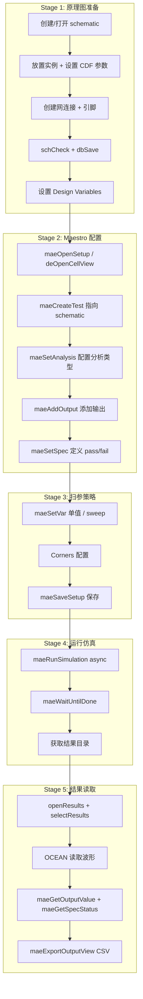

# Virtuoso 设计仿真完整流程

端到端流程指南：从原理图创建到 Maestro 仿真配置、运行、结果读取。

**与 ade.md 的关系**：ade.md 是 mae* API 函数字典，本文档是「什么时候用什么」的流程决策指南。

---

## 一、流程概览图



---

## 二、关键阶段详解

### Stage 1: 原理图准备

**必要步骤**：

```python
from virtuoso_bridge import VirtuosoClient
client = VirtuosoClient.from_env()

lib, cell = "MYLIB", "TB_MYCELL"

# 方式 A: Python API（推荐）
with client.schematic.edit(lib, cell) as sch:
    sch.add_instance("analogLib", "vdc", (0, 0), name="V0", params={"vdc": "0.8", "acm": "1"})
    sch.add_instance("analogLib", "res", (1.5, 0), name="R0", params={"r": "1k"})
    sch.add_instance("analogLib", "cap", (3.0, 0), name="C0", params={"c": "c_val"})  # design variable
    sch.add_wire_between_instance_terms("V0", "PLUS", "R0", "PLUS")
    sch.add_pin_to_instance_term("C0", "PLUS", "OUT")

# 方式 B: SKILL 操作列表
client.load_il("examples/01_virtuoso/assets/schematic_ops.il")
commands = [
    f'SchOpenNew("{lib}" "{cell}")',
    'SchCreateAnalogInst("vdc" "V0" 0.0 0.0 "R0")',
    'SchSetInstParam("V0" "vdc" "0.8")',
    'SchSetInstParam("V0" "acm" "1")',       # AC magnitude
    'SchNetLabel("V0" "PLUS"  "VDD")',
    'SchSave()',
]
client.execute_operations(commands)
```

**决策点：CDF 参数 vs Design Variable**

| 方式 | 原理图可见 | Maestro 可 sweep | 适用场景 |
|------|-----------|------------------|----------|
| CDF 参数（实例级） | ✓ | ✓（继承） | 固定值参数 |
| dbCreateParam（cellview 级） | ✓ | ✓ | 器件尺寸参数 |
| maeSetVar（Maestro 级） | ✗ | ✓ | 仅仿真用参数 |

**最佳实践**：
- 需在原理图中显示的参数 → `dbCreateParam(cv, "W1", "80u", 'string)`
- 仅仿真中 sweep → `maeSetVar("c_val", "1p,100f")`
- 两处都需要 → CDF 设为变量名（如 `"c_val"`），再用 maeSetVar sweep

**关键检查**：
```python
# 仿真前必须执行！
cv_var = "_myCv"
client.execute_skill(f'{cv_var} = dbOpenCellViewByType("{lib}" "{cell}" "schematic" nil "a")')
client.execute_skill(f'schCheck({cv_var})')  # 返回 (errorCount warningCount)
client.execute_skill(f'dbSave({cv_var})')
```

---

### Stage 2: Maestro 配置

**打开 Maestro 的两种方式**：

```python
# 方式 A: 纯后台（无 GUI）
r = client.execute_skill(f'maeOpenSetup("{lib}" "{cell}" "maestro")')
ses = r.output.strip('"')  # e.g. "fnxSession4"

# 方式 B: 打开 GUI（推荐，结果可显示）
client.execute_skill(f'deOpenCellView("{lib}" "{cell}" "maestro" "maestro" nil "r")')
client.execute_skill('maeMakeEditable()')  # 必须立即调用！
r = client.execute_skill(f'maeOpenSetup("{lib}" "{cell}" "maestro")')
ses = r.output.strip('"')
```

**创建 Test**：

```python
client.execute_skill(
    f'maeCreateTest("AC" ?lib "{lib}" ?cell "{cell}" '
    f'?view "schematic" ?simulator "spectre" ?session "{ses}")')
```

**配置 Analysis**：

```python
# 禁用默认 tran
client.execute_skill(f'maeSetAnalysis("AC" "tran" ?enable nil ?session "{ses}")')

# AC 分析：1 Hz - 10 GHz，20 pts/decade
client.execute_skill(
    f'maeSetAnalysis("AC" "ac" ?enable t '
    f'?options `(("start" "1") ("stop" "10G") '
    f'("incrType" "Logarithmic") ("stepTypeLog" "Points Per Decade") '
    f'("dec" "20")) ?session "{ses}")')

# TRAN 分析：60 ns，conservative preset
client.execute_skill(
    f'maeSetAnalysis("TRAN" "tran" ?enable t '
    f'?options `(("stop" "60n") ("errpreset" "conservative")) ?session "{ses}")')
```

**决策点：Analysis 参数格式**

两种格式都有效：
```python
# 格式 A: backtick（推荐）
f'?options `(("start" "1") ("stop" "10G"))'

# 格式 B: list(list(...))
f'?options list(list("start" "1") list("stop" "10G"))'
```

---

### Stage 3: 输出与 Spec 定义

**添加输出**：

```python
# 波形输出（net 类型）
client.execute_skill(
    f'maeAddOutput("Vout" "AC" ?outputType "net" '
    f'?signalName "/OUT" ?session "{ses}")')

# 表达式输出（point 类型）
# 注意：频域分析用 VF()，时域用 VT()
client.execute_skill(
    f'maeAddOutput("BW" "AC" ?outputType "point" '
    f'?expr "bandwidth(mag(VF(\\"/OUT\\")) 3 \\"low\\")" ?session "{ses}")')

client.execute_skill(
    f'maeAddOutput("maxOut" "TRAN" ?outputType "point" '
    f'?expr "ymax(VT(\\"/OUT\\"))" ?session "{ses}")')
```

**添加 Spec**：

```python
# 带宽 > 1 GHz
client.execute_skill(f'maeSetSpec("BW" "AC" ?gt "1G" ?session "{ses}")')

# 最大输出 < 400 mV
client.execute_skill(f'maeSetSpec("maxOut" "TRAN" ?lt "400m" ?session "{ses}")')
```

**决策点：VF() vs v() vs VT()**

| 分析类型 | 正确函数 | 错误函数 |
|----------|----------|----------|
| AC | `VF("/net")` | `v("/net")` ❌ |
| TRAN | `VT("/net")` | `v("/net")` ❌ |
| DC | `v("/net")` | — |

**Spec 操作符**：
- `?lt` — 小于
- `?gt` — 大于
- `?minimum` — 最小值
- `?maximum` — 最大值
- `?tolerence` — 允许误差

---

### Stage 4: 扫参策略

**单参数 Parametric Sweep**：

```python
# 逗号分隔值 → sweep 所有组合
client.execute_skill(f'maeSetVar("c_val" "1p,100f,5p" ?session "{ses}")')
```

**多参数组合（Corners）**：

Corners 配置需要编辑 `maestro.sdb` XML，SKILL API 仅支持 enable/disable：

```python
# 创建空 corner（仅名称）
client.execute_skill(f'maeSetCorner("tt_25" ?enabled t ?session "{ses}")')

# 删除 corner
client.execute_skill(f'maeDeleteCorner("tt_25" ?session "{ses}")')
```

**决策点：Parametric Sweep vs Corners vs Monte Carlo**

| 场景 | 推荐方式 | 示例 |
|------|----------|------|
| 单参数离散值 | maeSetVar("x" "1p,2p,5p") | C 值扫描 |
| 多参数组合 | Corners（需 sdb 编辑） | VDD + temp 组合 |
| 工艺偏差分布 | Monte Carlo | MOS 参数分布 |

---

### Stage 5: 运行仿真

**正确方式（异步 + 等待）**：

```python
# ✅ 推荐：异步运行
client.execute_skill(f'maeRunSimulation(?session "{ses}")')
client.execute_skill("maeWaitUntilDone('All)", timeout=300)  # 单独等待
```

**错误方式（禁止使用）**：

```python
# ❌ 阻塞 GUI 事件循环，导致连接断开
client.execute_skill(f'maeRunSimulation(?waitUntilDone t ?session "{ses})')
```

**获取结果目录**：

```python
r = client.execute_skill('asiGetResultsDir(asiGetCurrentSession())')
results_dir = r.output.strip('"')

# 处理 .tmpADEDir 路径
if ".tmpADEDir" in results_dir:
    base = results_dir.split(".tmpADEDir")[0]
    r = client.run_shell_command(f"ls -1d {base}Interactive.*/psf/AC 2>/dev/null | tail -1")
    results_dir = r.output.strip()
```

---

### Stage 6: 结果读取

**方式 A: OCEAN API**：

```python
client.execute_skill(f'openResults("{results_dir}")')
client.execute_skill('selectResults("ac")')  # 或 "tran"
client.execute_skill('outputs()')            # 列出可用信号
client.execute_skill('sweepNames()')         # 列出 sweep 变量

# 导出波形到文本
client.execute_skill(
    f'ocnPrint(dB20(mag(v("/OUT"))) ?numberNotation (quote scientific) '
    f'?numSpaces 1 ?output "/tmp/ac_db.txt")')
client.download_file('/tmp/ac_db.txt', 'output/ac_db.txt')
```

**方式 B: Maestro Results API**：

```python
client.execute_skill('maeOpenResults()')

# 读取 sweep 点的输出值
for point_id in range(1, num_sweep_points + 1):
    r_val = client.execute_skill(f'maeGetOutputValue("BW" "AC" ?pointId {point_id})')
    r_spec = client.execute_skill(f'maeGetSpecStatus("BW" "AC" ?pointId {point_id})')
    print(f"point {point_id}: BW = {r_val.output}, spec = {r_spec.output}")

client.execute_skill('maeCloseResults()')
```

**方式 C: CSV 导出**：

```python
client.execute_skill('maeExportOutputView(?fileName "/tmp/results.csv" ?view "Detail")')
client.download_file('/tmp/results.csv', 'output/results.csv')
```

---

## 三、典型场景示例

### 场景 A: AC 分析 + Parametric Sweep + Spec

**参考**：`examples/01_virtuoso/ade/01_rc_filter_sweep.py`

**流程要点**：
1. Schematic: CDF 参数设为 `"c_val"`（变量名）
2. Maestro: `maeSetVar("c_val" "1p,100f")` → sweep
3. Output: `bandwidth(mag(VF("/OUT")) 3 "low")` — 用 VF()
4. Spec: `maeSetSpec("BW" "AC" ?gt "1G")`
5. Results: `maeGetOutputValue("BW" "AC" ?pointId N)` 遍历 sweep 点

### 场景 B: TRAN 瞬态仿真

**参考**：`examples/02_spectre/01_inverter_tran.py`

**流程要点**：
1. 网表驱动（无需 Virtuoso GUI）
2. SpectreSimulator 直接运行 `.scs` 文件
3. 结果解析：PSF 格式 → Python dict

### 场景 C: PSS + Pnoise 周期稳态

**参考**：`examples/02_spectre/04_strongarm_pss_pnoise.py`

**流程要点**：
1. Analysis: `pss`（fund frequency） + `pnoise`（frequency range）
2. Jitter Event: 需复制 `active.state`（SKILL API 无法完整配置）
3. 结果：时域波形 + 频域噪声

---

## 四、扫参设置规范速查

### 参数设置层级

| 层级 | 设置方式 | 原理图可见 | Maestro sweep |
|------|----------|-----------|---------------|
| 实例级 CDF | `SchSetInstParam("R0" "r" "1k")` | ✓ | ✓（继承） |
| Cellview 级 DV | `dbCreateParam(cv, "W1", "80u", 'string)` | ✓ | ✓ |
| Maestro 级变量 | `maeSetVar("c_val" "1p,100f")` | ✗ | ✓ |

### Sweep 值格式

```python
# 离散值（逗号分隔）
maeSetVar("c_val", "1p,100f,5p")

# 范围（step syntax）
maeSetVar("VDD", "0.8:0.05:1.0")  # 0.8 → 1.0, step 0.05
```

### 多参数组合

| 方式 | 组合数 | 适用场景 |
|------|--------|----------|
| maeSetVar 多参数逗号分隔 | N×M | Cartesian product |
| Corners | 自定义 | VDD + temp + process 组合 |
| Monte Carlo | 随机样本 | 工艺偏差分布 |

---

## 五、完整流程代码模板

```python
#!/usr/bin/env python3
"""完整 Maestro 仿真流程模板"""

from virtuoso_bridge import VirtuosoClient

client = VirtuosoClient.from_env()
lib, cell = "MYLIB", "TB_MYCELL"

# === Stage 1: Schematic ===
with client.schematic.edit(lib, cell) as sch:
    sch.add_instance("analogLib", "vdc", (0, 0), name="V0", params={"vdc": "0.8", "acm": "1"})
    sch.add_instance("analogLib", "res", (1.5, 0), name="R0", params={"r": "1k"})
    sch.add_instance("analogLib", "cap", (3.0, 0), name="C0", params={"c": "c_val"})
    sch.add_wire_between_instance_terms("V0", "PLUS", "R0", "PLUS")
    sch.add_wire_between_instance_terms("R0", "MINUS", "C0", "PLUS")
    sch.add_pin_to_instance_term("C0", "PLUS", "OUT")

# === Stage 2: Maestro ===
client.execute_skill(f'deOpenCellView("{lib}" "{cell}" "maestro" "maestro" nil "r")')
client.execute_skill('maeMakeEditable()')
r = client.execute_skill(f'maeOpenSetup("{lib}" "{cell}" "maestro")')
ses = r.output.strip('"')

client.execute_skill(
    f'maeCreateTest("AC" ?lib "{lib}" ?cell "{cell}" ?view "schematic" ?simulator "spectre" ?session "{ses}")')

client.execute_skill(f'maeSetAnalysis("AC" "tran" ?enable nil ?session "{ses}")')
client.execute_skill(
    f'maeSetAnalysis("AC" "ac" ?enable t ?options `(("start" "1") ("stop" "10G") ("dec" "20")) ?session "{ses}")')

client.execute_skill(
    f'maeAddOutput("Vout" "AC" ?outputType "net" ?signalName "/OUT" ?session "{ses}")')
client.execute_skill(
    f'maeAddOutput("BW" "AC" ?outputType "point" ?expr "bandwidth(mag(VF(\\"/OUT\\")) 3 \\"low\\")" ?session "{ses}")')
client.execute_skill(f'maeSetSpec("BW" "AC" ?gt "1G" ?session "{ses}")')

# === Stage 3: Sweep ===
client.execute_skill(f'maeSetVar("c_val" "1p,100f" ?session "{ses}")')

# === Stage 4: Save + Run ===
client.execute_skill(f'maeSaveSetup(?lib "{lib}" ?cell "{cell}" ?view "maestro" ?session "{ses}")')
client.execute_skill(f'maeRunSimulation(?session "{ses}")')
client.execute_skill("maeWaitUntilDone('All)", timeout=300)

# === Stage 5: Results ===
client.execute_skill('maeOpenResults()')
for pid in range(1, 3):  # 2 sweep points
    r_bw = client.execute_skill(f'maeGetOutputValue("BW" "AC" ?pointId {pid})')
    r_spec = client.execute_skill(f'maeGetSpecStatus("BW" "AC" ?pointId {pid})')
    print(f"point {pid}: BW = {r_bw.output}, spec = {r_spec.output}")
client.execute_skill('maeCloseResults()')
```